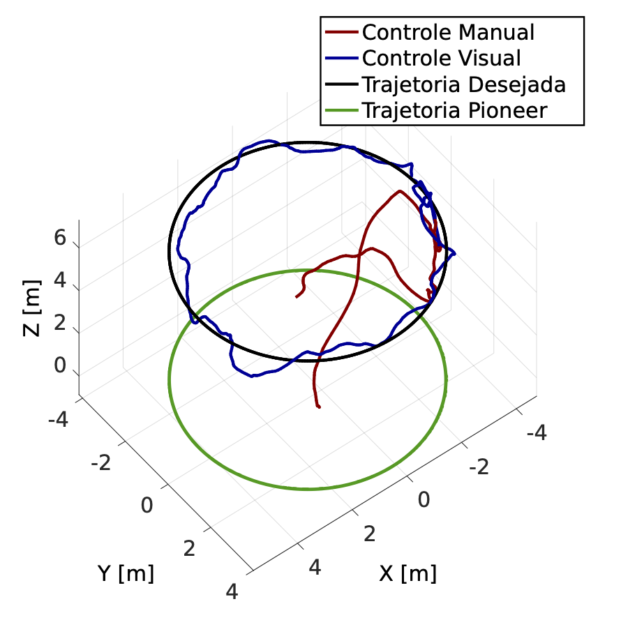

# MATLAB Graphics for Pixhawk Flight Log

Prints local position and yaw logs, with distinction between flight modes.

## To execute

Pick a log file and call the function `graphics` inside MATLAB. 

`graphics('logs_artigo/124-08-29-circle-4350mm.mat')`

## Sample Image
Used on this [paper](https://www.ufrgs.br/sbai17/papers/paper_549.pdf)

